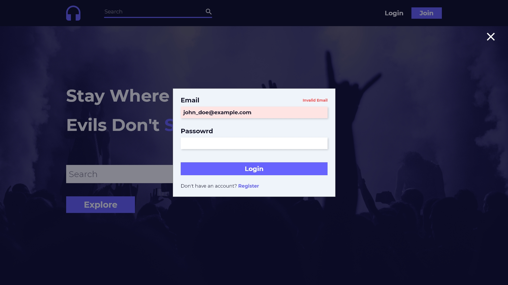
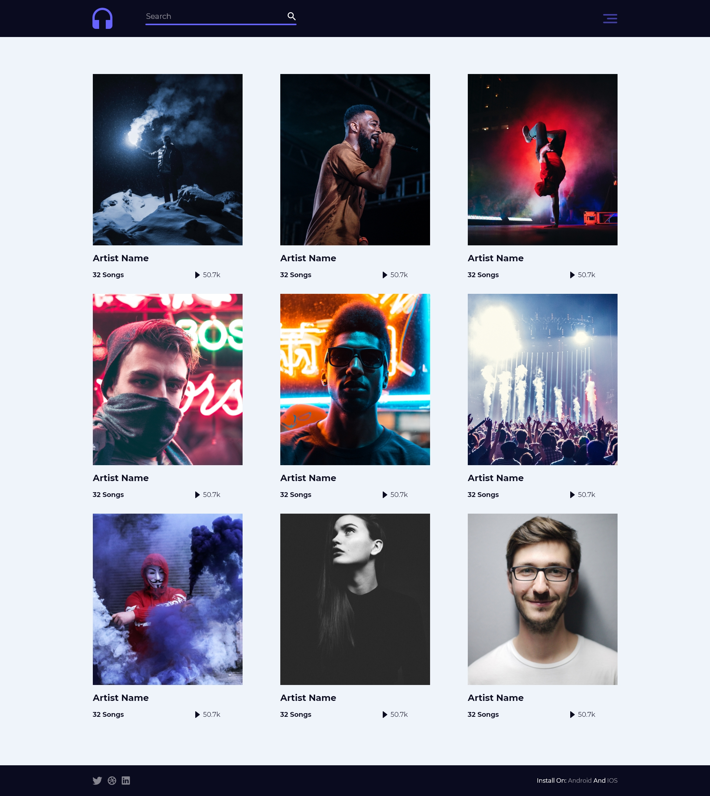
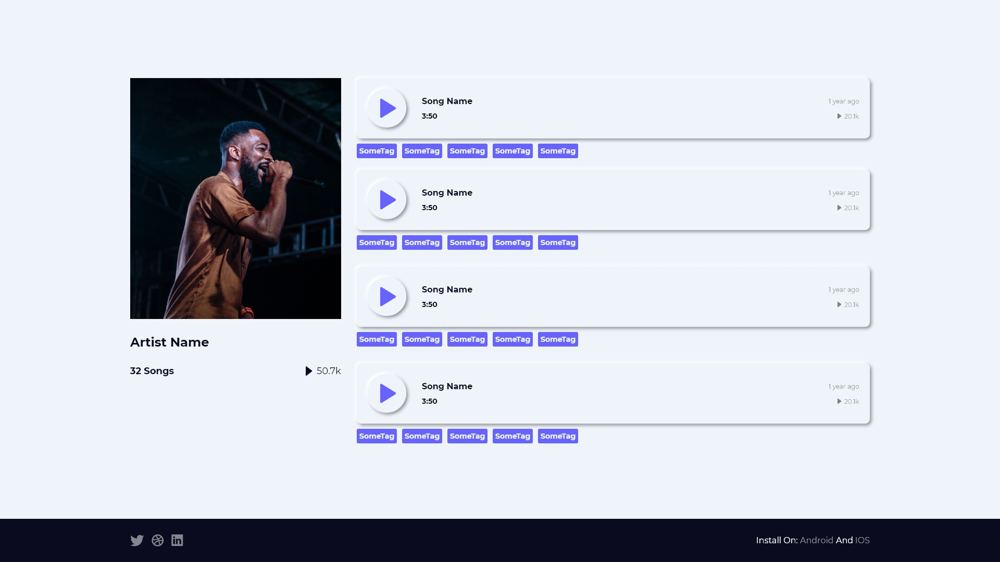
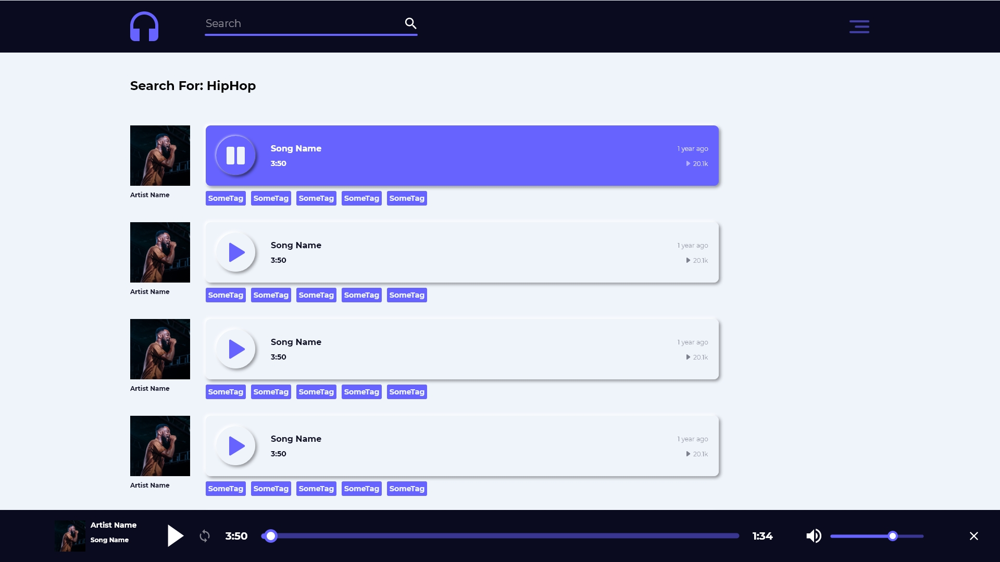

# **Music**
----------------------
Music app built with Laravel and Angular

### **Setup**
-------------
##### Laravel
1. Insatll laravel project using this [guide](https://devmarketer.io/learn/setup-laravel-project-cloned-github-com/)
2. Add algoali app key to `.env` file


##### Angular
1. Insatll dependancies
    ```bash
    npm install
    ```
2. Add back end base URL to `angular\src\environments\environment.ts`

## **Design**
-----------------------

#### **Home**


#### **Login**


#### **Explore**


#### **Profile**


#### **Search**



My
[Twitter](https://twitter.com/MrMohamed98) | 
[Linkedin](https://www.linkedin.com/in/mohamed-abdallah-b731b61a2/)